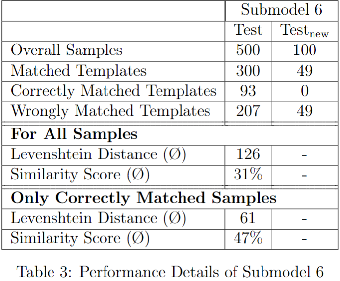

## Invoice Information Extraction

This repository contains code, sample data and (aggregated) results of a Bachelor's thesis on *Improving Invoice
Information Extraction: An Investigation into Ensemble Learning Methods in Named Entity Recognition*.  
Specifically, the thesis investigates whether a combination of approaches both specific to the invoice extraction domain
and of analogous domains in the form of an ensemble results in increased performance of the extraction system.
Entities targetted for extraction are:

* Invoice Date
* Invoice Number
* Invoice Gross Amount
* Invoice Tax Amount
* Order Number
* Issuer Name
* Issuer IBAN
* Issuer Address

The dataset used throughout the thesis is the [Inv3D](https://felixhertlein.github.io/inv3d/) dataset containing
information on 25,000 synthetically generated English invoices across 100 different layouts.

---

## Approaches and Algorithms employed

Six approaches - five of which leverage deep learning and one being template-based - were implemented and tested first 
in isolation and then in concert in the form of an ensemble:
* Submodel 1 - BERT-based Approach 
* Submodel 2 - CloudScan-based Approach
* Submodel 3 - BBMC-based Approach
* Submodel 4 - BiLSTM-CNN-CRF-based Approach
* Submodel 5 - GCN-based
* Submodel 6 - Intellix-based

To arrive at final predictions, the ensemble voting scheme adhered to the following rationale:
* Should none of the submodels employed return any entity predictions, ensemble predictions are also empty.
* In case submodel predictions are identical or, in total, only one prediction is returned, the ensemble prediction is equal to the unique proposal.
* In any other case, i.e., more than zero or one submodel predictions are returned, the longest, common substring of all predictions per entity is taken as the ensemble result.
---

## Results
When employed in isolation, performance of the deep learning-based submodels was assessed based on accuracy and a
custom metric comparing the indices of non-"undefined" labels in the predictions and the gold labels.  
To assess the quality of the
template classification system it was investigated for how many of the
samples contained within the respective test set an identified template was
returned. In a second step it was then analysed for how many of these
samples the classified template actually matched the invoice template as
per ground truth. To allow for effective comparison of model versus ensemble
performance, the ensemble was also assessed on the same metrics as the template-based approach

Performance evaluation highlights that the ensemble approach does not
conclusively increase or decrease effectivity, but its overall performance is
highly dependent on the underlying document template. It can further be
concluded that models incorporating custom features to encode additional
contextual and structural information outperformed those without. On the
same note, there was no clear indication that contextualised word
embeddings produced by, e.g., BERT yielded better results than distributed
text representations. It was further confirmed that the development of a
template-based NER approach introduces added user effort with no
guarantee of outperforming deep learning-based models. Ultimately, in the
form and structure presented in this thesis, overall performance of the
ensemble was not high enough to warrant its additional requirements in
terms of added employment effort, model complexity and computational
resources.
---

## Citations

 

@article{Dataset,  
title = {Inv3D: a high-resolution 3D invoice dataset for template-guided single-image document unwarping},  
author = {Hertlein, Felix and Naumann, Alexander and Philipp, Patrick},  
year = 2023,  
month = {Apr},  
day = 29,  
journal = {International Journal on Document Analysis and Recognition (IJDAR)},  
doi = {10.1007/s10032-023-00434-x},  
ISSN = {1433-2825},  
url = {https://doi.org/10.1007/s10032-023-00434-x}  
